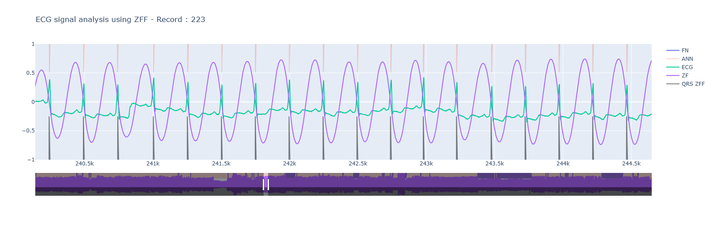

The code uses the zero frequency filtering (ZFF) analysis and applies the principle on ECG data to identify R--peaks. 
ZFF method implments a decaying resonator centered at 0 Hz, and filters the signal. The resultant signal exhibits a rising trend, which can be eliminated using a trend removal filter. 

The following figure shows an example to illustrate identification of R--peaks in ECG using ZFF. Fig. (a) shows a segment $S_1$ of the ECG signal obtained from the MIT--BIH database along with the manually annotated R--peaks ({red} - -) locations. Fig. (b) shows the processed signal $S_{12}$, obtained by multiplying $S_1$ with its derivative $S_2$, along with annotations. This is done to enhance the singular behavior of the R--peaks. It can be observed that enhancement of R--peaks during the processing step yields a pseudo--periodic signal with positive polarity impulse--like behavior. Fig. (c) shows the ZFF signal $Y$ obtained from $S_{12}$. The $Z_{PNZ}$ locations in $Y$ ({black} - -) can be seen appearing in correspondence to the annotated locations ({red} - -). 
 
  

Following figure provides the performance computed over all the records in MIT-BIH database. 

